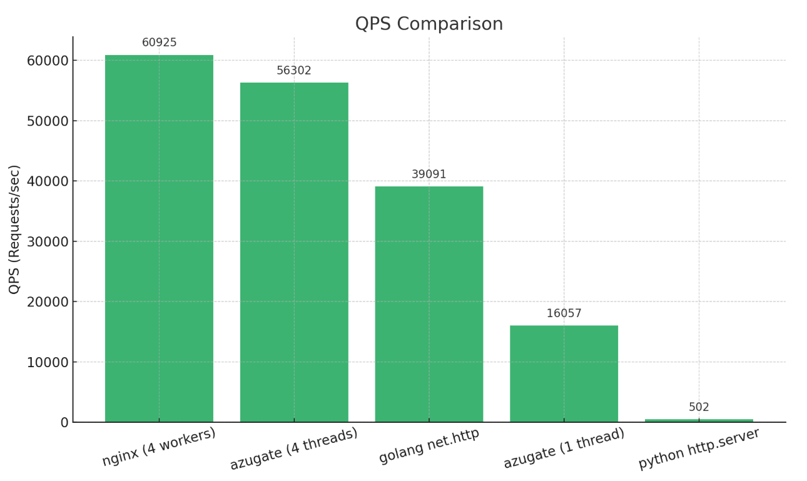

# azugate

### Features

- HTTP(S) proxy support (local files and remote resources)
- WebSocket support
- HTTP Gzip compression and chunked transfer encoding
- Rate limiting
- OAuth integration via Auth0
- Management through gRPC API
- Linux sendfile() optimization
- High-performance asynchronous I/O

### Build

You will need a compiler that supports c++20, along with CMake and vcpkg, to build this project. The project builds successfully on both M2 Mac and x86-64 Linux.
 
```shell
  mkdir build && cd build
  cmake --preset=default ..
  cmake --build .
```

### Build Image

```
  docker buildx build --platform linux/amd64,linux/arm64 -t azusaing/azugate:latest .
```

### Run (docker)

```shell
  # default configurations:
  docker run -p 8080:8080 -p 50051:50051 azusaing/azugate:latest
  
  # static files & custom configurations:
  docker run \
  -p 8080:8080 \
  -p 50051:50051 \
  -v ./resources:/app/resources \
  -v ./config.yaml:/app/bin/config.yaml azusaing/azugate:latest \
  ./azugate -c config.yaml

  # or use docker-compose under the root folder:
  docker-compose up -d
```

### Dev Tools

#### wrk

```shell
  wrk -t1 -c20 -d10s http://localhost:5080
```

#### ab

```shell
  wrk -t1 -c20 -d10s http://localhost:5080
```

#### buf

```shell
 # under proto/
  buf lint
  buf format -w
  buf generate
```

### Perf

```shell
 # CPU: 12th Gen Intel(R) Core(TM) i5-12600K
 # Cores: 2
 # Command: 
 wrk -c400 -t4 -d5s http://172.17.0.2:8080/login/login.html
```



